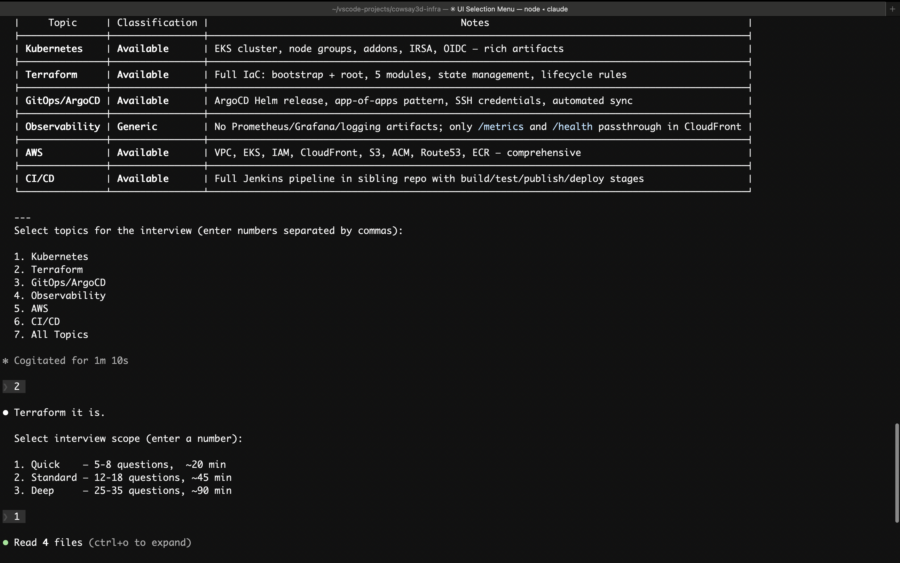

# Roman's Devops Skills

This repository contains custom `SKILL.md` based devops skills.


## Skills

| Skill | Description | Key files |
|---|---|---|
| `create-drawio` | Generates valid `.drawio` architecture diagrams (especially AWS-focused) with containers, icons, and clean edge routing. | `create-drawio/SKILL.md`, `create-drawio/examples/aws-architecture.xml` |
| `devops-terraform-interviewer` | Runs a structured, repo-aware DevOps mock interview with a Terraform-depth focus plus cross-domain coverage (Kubernetes, Helm, ArgoCD, AWS, reliability, security). | `devops-terraform-interviewer/SKILL.md`, `devops-terraform-interviewer/rubrics.md`, `devops-terraform-interviewer/checklists/` |
| `devops-kubernetes-interviewer` | Runs a structured, repo-aware DevOps mock interview with a Kubernetes-depth focus (troubleshooting and operations) plus cross-domain coverage. | `devops-kubernetes-interviewer/SKILL.md`, `devops-kubernetes-interviewer/rubrics.md`, `devops-kubernetes-interviewer/checklists/` |
| `devops-gitops-interviewer` | Runs a structured, repo-aware DevOps mock interview with GitOps-depth focus (ArgoCD + Kubernetes troubleshooting), plus cross-domain coverage. | `devops-gitops-interviewer/SKILL.md`, `devops-gitops-interviewer/rubrics.md`, `devops-gitops-interviewer/checklists/` |

### DevOps Interviewer in action

The interviewer skill scans your repo, classifies available topics, and lets you pick the focus area and scope:


| `postgres` | Postgres performance and schema best-practices reference (Supabase-oriented), including query, indexing, locking, connection, and RLS guidance. | `postgres/SKILL.md`, `postgres/references/` |


## Installation

Copy the same skill directories to the target skills path for your agent.

### Claude install path

`~/.claude/skills`

### Codex install path

`$CODEX_HOME/skills` (default: `~/.codex/skills`)

### Install from local clone

```bash
# Claude:
# DEST="$HOME/.claude/skills"
#
# Codex:
# DEST="${CODEX_HOME:-$HOME/.codex}/skills"

mkdir -p "$DEST"
cp -R create-drawio "$DEST/"
cp -R devops-terraform-interviewer "$DEST/"
cp -R devops-kubernetes-interviewer "$DEST/"
cp -R devops-gitops-interviewer "$DEST/"
cp -R postgres "$DEST/"
```

## Verify and use

1. Restart your agent (Codex or Claude) so new skills are loaded.
2. Confirm each installed skill contains `SKILL.md` under `<skills-dir>/<skill-name>/`.
