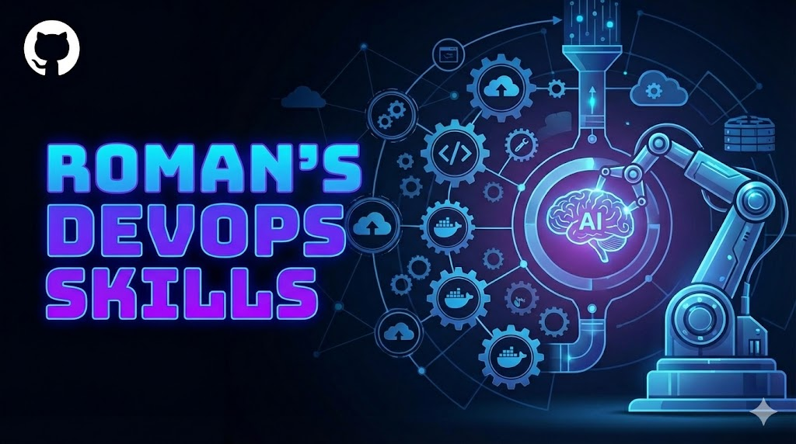

# AI Skills (Codex + Claude)

This repository contains custom `SKILL.md`-based skills designed to work for both Codex and Claude users.



## Skills

| Skill | Description | Key files |
|---|---|---|
| `create-drawio` | Generates valid `.drawio` architecture diagrams (especially AWS-focused) with containers, icons, and clean edge routing. | `create-drawio/SKILL.md`, `create-drawio/examples/aws-architecture.xml` |
| `devops-terraform-interviewer` | Runs a structured, repo-aware DevOps mock interview with a Terraform-depth focus plus cross-domain coverage (Kubernetes, Helm, ArgoCD, AWS, reliability, security). | `devops-terraform-interviewer/SKILL.md`, `devops-terraform-interviewer/rubrics.md`, `devops-terraform-interviewer/checklists/` |
| `devops-kubernetes-interviewer` | Runs a structured, repo-aware DevOps mock interview with a Kubernetes-depth focus (troubleshooting and operations) plus cross-domain coverage. | `devops-kubernetes-interviewer/SKILL.md`, `devops-kubernetes-interviewer/rubrics.md`, `devops-kubernetes-interviewer/checklists/` |
| `postgres` | Postgres performance and schema best-practices reference (Supabase-oriented), including query, indexing, locking, connection, and RLS guidance. | `postgres/SKILL.md`, `postgres/references/` |

## Cross-Agent Compatibility Rules

To keep a single skill folder compatible across Codex and Claude:

1. Keep `SKILL.md` as the canonical entrypoint in each skill directory.
2. Use YAML frontmatter with `name` and `description` (shared baseline across tools).
3. Avoid agent-specific tool names in required workflow steps; describe behavior in tool-neutral terms.
4. Keep optional files (`CLAUDE.md`, `agents/openai.yaml`) additive, not required for core behavior.

## Installation

Copy the same skill directories to the target skills path for your agent.

<<<<<<< HEAD
=======
### Claude install path

`~/.claude/skills`

### Codex install path

`$CODEX_HOME/skills` (default: `~/.codex/skills`)

>>>>>>> 737c1a6 (feat: Implemented skill cross AI compatibility)
### Install from local clone

```bash
# Claude:
# DEST="$HOME/.claude/skills"
#
# Codex:
# DEST="${CODEX_HOME:-$HOME/.codex}/skills"

mkdir -p "$DEST"
cp -R create-drawio "$DEST/"
cp -R devops-terraform-interviewer "$DEST/"
cp -R devops-kubernetes-interviewer "$DEST/"
cp -R postgres "$DEST/"
```

### Install from GitHub

Clone and copy from the repo:

```bash
git clone https://github.com/<owner>/<repo>.git

# Claude:
# DEST="$HOME/.claude/skills"
#
# Codex:
# DEST="${CODEX_HOME:-$HOME/.codex}/skills"

mkdir -p "$DEST"
cp -R <repo>/create-drawio "$DEST/"
cp -R <repo>/devops-terraform-interviewer "$DEST/"
cp -R <repo>/devops-kubernetes-interviewer "$DEST/"
cp -R <repo>/postgres "$DEST/"
```


## Verify and use

1. Restart your agent (Codex or Claude) so new skills are loaded.
2. Confirm each installed skill contains `SKILL.md` under `<skills-dir>/<skill-name>/`.

## Codex users
=======
Optional Codex-side validation:

```bash
VALIDATOR="${CODEX_HOME:-$HOME/.codex}/skills/.system/skill-creator/scripts/quick_validate.py"
for skill in create-drawio devops-terraform-interviewer devops-kubernetes-interviewer postgres; do
  python3 "$VALIDATOR" "$skill"
done
```
